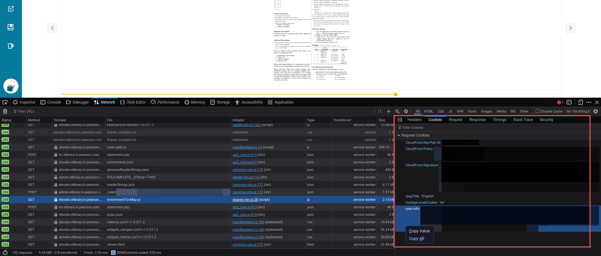

## Pearson E-Library Downloader

Does exactly what it says.

```sh
usage: downloader.py [-h] [-o OUTPUT_DIR] [--no-pages] [--no-stylesheets] [--no-images] [--no-fonts]

Download Pearson eLibrary books.

options:
  -h, --help            show this help message and exit
  -o, --output-dir OUTPUT_DIR
                        Output directory (default: book)
  --no-pages, -P        Do not download XHTML pages
  --no-stylesheets, --no-css, -C
                        Do not download stylesheets
  --no-images, -I       Do not download images
  --no-fonts, -F        Do not download fonts
  ```

## Who can use this

Generally for people who have access to books in their eLibrary. This could be if say, you have bought a Pearson book, and added it to your Pearson eLibrary by using the scratch code on the front cover of the book.

## How to use

- Clone this repository and `cd` into it.
    ```sh
    git clone --depth=1 https://github.com/BillyDoesDev/pearson-e-library-downloader.git && cd pearson-e-library-downloader 
    ```
- Log in to https://ebooks.elibrary.in.pearson.com/wr/index.html using your credentials.
- Open any book in your library. Fire up the network tab on your browser (`Ctrl+Shift+E` on furryfox), and look for any suitable request with the necessary cookies.
    
    

    Now, furryfox is kind enough to let you copy the cookies as `json` by right-clicking and selecting `Copy All`. Rest of y'all, all the best.
- Create a `.cookies.json` file in the project root dir and paste in the cookie contents.
    It should look something like this:
    ```json
    {
        "Request Cookies": {
            "CloudFront-Key-Pair-Id": "xxx",
            "CloudFront-Policy": "xxx",
            "CloudFront-Signature": "xxx",
            "langTitle": "English",
            "myAppLocaleCookie": "en",
            "user-info": "{...}"
        }
    }
    ```
- Now we're finally ready to run. Install the necessary dependencies using your package manager of choice. Using `uv` is *highly recommended.*
    ```sh
    uv init .
    uv sync
    uv run downloader.py -h

    # Example:
    # uv run downloader.py -o pearson-CSIT
    # ^ downloads your desired book in an epub-like structure to ./pearson-CSIT/
    ```
- Helper scripts (results may vary):
    ```sh
    ./build-epub.sh       # compresses downloaded contents to an epub
    uv run renderer.py -h # converts downloaded contents to a single pdf
    ```

### Notes

At least according to my testing, it was quite difficult to get a pre-compiled epub/pdf directly from source. The `downloader.py` script tries its best to assemble files in an epub-like format. The `build-epub.sh` script can then be run to actually compress the downloaded files into an actual `.epub` format.

The only drawback is that, because of the way these files are served, and in turn, downloaded and structured, a lot of epub readers (such as calibre, or okular, in my testing) don't render the files really well - not to mention how long they take.</br>
Alternatively, you could use online epub readers such as these, which render the text much better:
- https://epub-reader.online/
- https://epubreader.net/ (GitHub: https://github.com/satorumurmur/bibi)

**Another approach** thus, is to use a headless browser using something like `playwright`, have it render each page individually, print to pdf, and them merge them all together. Clearly, this is not optimal at all, and my CPU fans hate it. But, it mostly works, and the script `renderer.py` in this project does exactly that (aside form the ocassional text flying around here and there in the render).

That's all from my end. I hope you find this useful. I am a strong advocate for open information, and find it particularly annoying not being able to own content I have purchased.</br>
That being said, please use this tool only for content which you own, and certainly not for illegal purposes (wink wink). Have fun! 


## License

This project is licensed under the [MIT License](LICENSE).
